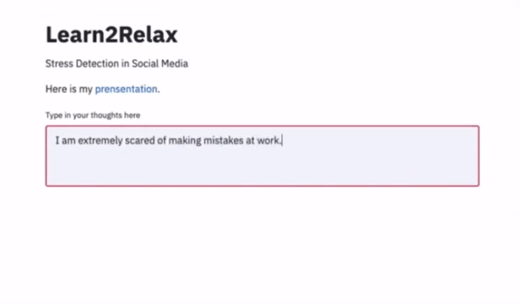
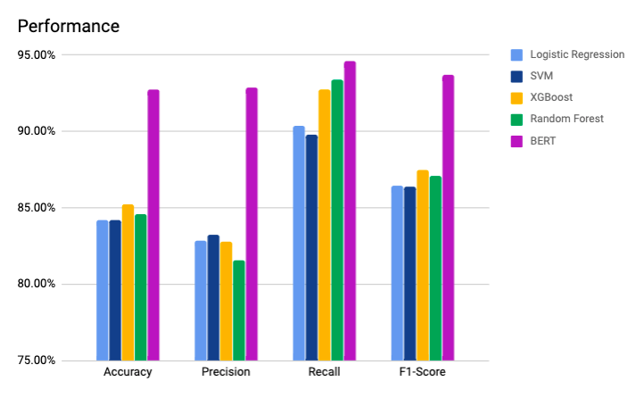
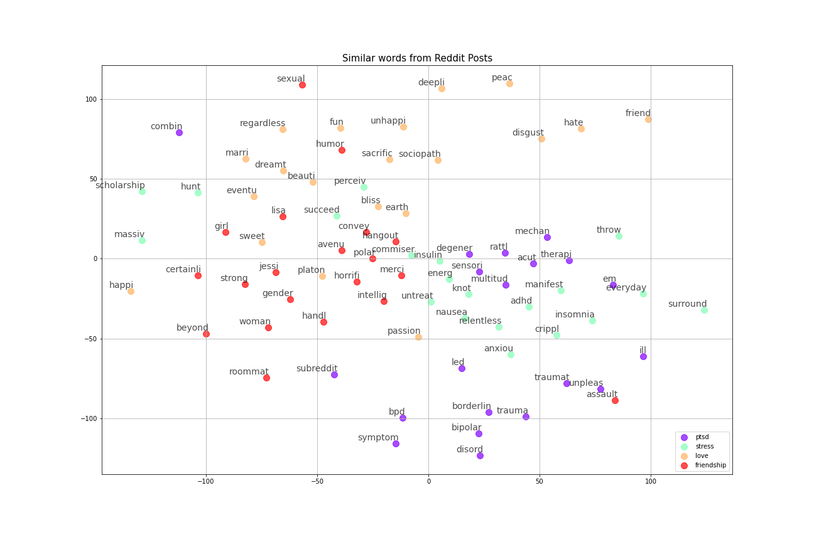
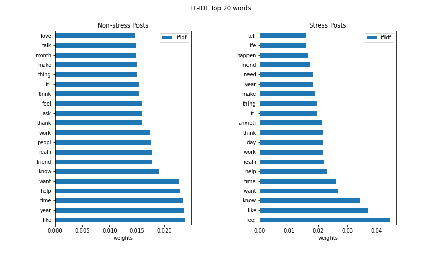

# Learn2Relax
Stress Detection on Social Media ([presentation](https://docs.google.com/presentation/d/1iZFROfJrI9I-OIB1vEbSchwLOnL0VAU-T9Yg5wtN2lM/edit#slide=id.p))

## Motivation
Social media is a major platform where people express their worries and stresses across the world. Learn2Relax was built in order to analyze content and identify stress from Reddit dataset by deploying NLP techniques. Word embeddings were pre-trained on unlabeled data and deployed by both discrete and neural supervised models. 

## Installation
- Clone the GitHub repository
> `git clone https://github.com/Evaaaaaaa/Learn2Relax.git`
- Change working directory
> `cd Learn2Relax`

- The model is tested on Python 3.7 with dependencies listed in `build/requirements.txt`. To install these Python dependencies, please run 
> `pip install -r build/requirements.txt`

- Or if you prefer to use Conda
> `conda install --file build/requirements.txt`

### Additional Setup (Optional)
- Install tensorflow for GPU to run BERT model on GPU
>`pip install tensorflow-gpu==1.15`
- Download and install [Docker application](https://docs.docker.com/get-docker/) to create a containerized application for the inference demo. If you are new to Docker, here’s a [quickstart guide](https://docs.docker.com/get-started/).
- The models use preprocessed data files in the `data/preprocessed` repository. However, if you want to reproduce the tokenization steps from scratch using raw datafiles in `data/raw`, you need to install NLTK and NLTK datasets
>`pip install nltk`

>`python configs/config.py`

If you are not using Conda, make sure you have Xcode installed if you use MacOS, otherwise `pip install nltk` might not work. To install the “minimum version” of Xcode, simply download the Command Line Tools DMG file from [here](https://developer.apple.com/download/more/) and follow the installation instructions. If you are using Windows/Linux and the installation does not work, try 
>`sudo apt-get install python3 python3-pip ipython3 build-essential python-dev python3-dev`

then install NLTK packages again.

## Inference App
To run the Streamlit web app in your browser, make sure dependencies listed in `build/requirements.txt` are installed then run 
>`cd streamlit`

>`streamlit run app.py`

If no browser window pops up, paste the Network URL in the browser and you will be able to see the app interface as below

To create a containerized application, in the project directory `Learn2Relax`, run
>`docker build --tag learn2relax-streamlit:1.0 .`

## Analysis
### Approaches
- Features for the labeled dataset were generated by five different feature extraction methods: unigram TF-IDF, bigram TF-IDF, Word2Vec with TF-IDF as weights and BERT embeddings. 
Word2Vec embeddings were also trained with 190k unlabeled Reddit posts. 

- After feature extraction, 9 classification models were trained: Logistic Regression, Naive Bayes, SVM, AdaBoost, Gradient Boosting, Decision Tree, Random Forest, XGBoost and BERT.

### Results
Best model for each featurization techniques and their performances:
|Featurization Method|Model|Accuracy|Precision|Recall|F1-Score|
|:-------------|:----------|:--------|:---------|:------|:--------|
|Unigram TF-IDF|Logistic Regression|84.23%  |82.87%   |90.36%|86.46%  |
|Bigram TF-IDF|SVM       |84.23%  |83.24%   |89.76%|86.38%  |
|Word2Vec + TF-IDF|XGBoost   |85.23%  |82.80%   |92.77%|87.50%  |
|Pretrained Embeddings|XGBoost   |84.56%  |81.58%   |93.37%|87.08%  |
|BERT Embeddings|BERT      |92.74%  |92.90%   |94.58%|93.73%  |
                                     

||Traditional ML Models        |BERT  |
|:---|:-----------------------------|:------|
|Avg. Training Time|01.837573 sec                |3 min 48.131239 sec|    
|Avg. Inference Time|00.004543 sec                |35.714544 sec|    
                                                            
- Recall is the most important metric here because we want to best prevent misclassification of stress posts as non-stressful which helps us better understand the stressful contents in social media.

- BERT is the most robust model with all four metrics the highest.
- All models are able to provide a confidence score in addition to prediction.

## Data
The labeled data is retrieved from Elsbeth Turcan & Kathleen McKeown [Dreaddit: A Reddit Dataset for Stress Analysis in Social Media](https://arxiv.org/abs/1911.00133). 

Picture below shows word similarities in the dataset

Top 20 frequent words in stressed posts and non-stressed posts are 

